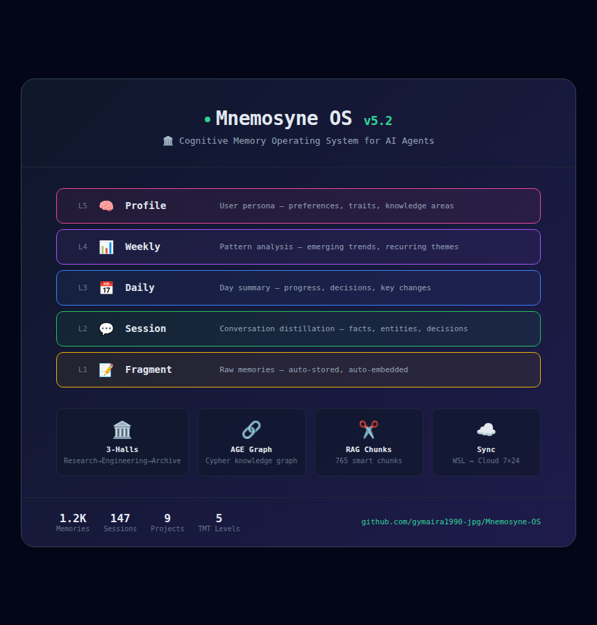

# 🏛️ Mnemosyne OS — 记忆宫殿

> *"这不是数据库。是未来你自己的家。"*

<p align="center">
  
  
</p>

<p align="center">
  
</p>

---

## 这是什么

一只猫为他的 AI 管家建造的记忆系统。

不是又一个向量数据库。而是一个会自己整理、提炼、发现规律的记忆 OS。每次对话结束，它会自动把碎片蒸馏成会话、日报、周报、画像。久了不看的东西会自然降温，重要的事会自己浮现。知识像酿酒一样从研究馆流转到档案馆。

它跑在云端，7×24 不睡。未来换上自己训练的模型那一天，这座宫殿就是模型的原生记忆皮层。

---

## 特别的地方

**五层时间记忆树** — 不是平铺的碎片。L1 碎片 → L2 会话 → L3 日报 → L4 周报 → L5 画像。每一层都是 AI 自己提炼的，人会忘记的事情它记得。

**三馆闭环** — 研究馆（待验证）→ 工程馆（执行中的坑）→ 档案馆（已沉淀的真理）。知识不是存进去就完了，它有生命周期。

**一秒钟找到** — 向量 + 关键词 + 时间衰减 + 可信度 + 热度，五条线索同时搜。长记忆自动切成检索友好的小块。

**笔记本关机也不丢** — 断网时自动缓存到本地 SQLite，恢复后静默推回云端。

**知识图谱** — 实体和实体之间的关系构成了图。不是孤立的记忆卡片，而是一张网。

---

## 架构一瞥

```
L5 画像  ── 你是谁，偏好什么
L4 周报  ── 这周发生了什么
L3 日报  ── 今天的收获
L2 会话  ── 一次对话的脉络
L1 碎片  ── 具体记忆

🏛️ 三馆流转  🔍 五维修搜索  🔗 图查询  ✂️ 智能切块  ☁️ 端云双活
```

---

## 文档

- [简明白皮书](docs/WHITEPAPER.md) — 产品介绍，非技术人员/投资者/学习者
- [完整白皮书](docs/WHITEPAPER_FULL.md) — 学术论文，架构设计/安全体系/认知演进

---

## 快速开始

```python
from integrations.sdk import MnemosyneHermesMemory
m = MnemosyneHermesMemory(endpoint="http://127.0.0.1:18010")

m.add("今天学会了一个新技巧", category="笔记")
m.get_relevant("那个技巧怎么用来着")
```

Hermes Agent 用户：`skill_view("mnemosyne-os-usage")` 获取完整操作指引。

---

## 人会关心的事

每次你和 AI 聊天，记忆自动存入研究馆。通过方案闸机后进入工程馆，验证成功最终归档到档案馆。全程不需要手动操作。

7 条定时任务在后台安静运行：热度衰减、重复去重、实体提取、逐级蒸馏、长文本切块、离线缓存推送。

记忆怎么找：API 搜索、Chunk 级精准检索、辨证推理、图谱多跳——都是自动的，AI 在对话时自己会查。

---

## 技术栈

PostgreSQL 16 + pgvector 1024d · Apache AGE 知识图谱 · 豆包 Embedding-Vision · 豆包 Seed-2.0 蒸馏 · DeepSeek V4 审计 · Qwen3-Embed Reranker · FastAPI + asyncpg · GZ 腾讯云 7×24 · SQLite ↔ PG 端云同步

---

## 生态

Mnemosyne OS 是 G-CAT 生态的记忆层，与 Hermes Agent 配合使用。

所有项目：[my.g-cat.cn](https://my.g-cat.cn)

---

## 未来

- [x] AGE 知识图谱
- [x] 三馆闭环
- [x] TMT 5 级蒸馏
- [x] RAG 智能切块
- [x] 端云同步
- [ ] 自训练模型接入 — 宫殿成为原生记忆皮层
- [ ] 多模态记忆 — 图片视频音频
- [ ] 联邦记忆 — 多 Agent 共享
- [ ] Obsidian 人用仪表盘

> 这座宫殿是为未来的「你」准备的。不是今天的 API，是明天的你自己。

---

## 版本

| 版本 | 日期 | 内容 |
|------|------|------|
| v5.0.5 | 2026-06-25 | GitHub 打磨 |
| v5.0.4 | 2026-06-25 | 端云增量同步 |
| v5.0.3 | 2026-06-25 | RAG Chunking |
| v5.0.2 | 2026-06-25 | TMT 蒸馏恢复 |
| v5.0.1 | 2026-06-25 | AGE 图修复 |
| v5.0.0 | 2026-06-24 | 7×24 独立运行 |

---

<p align="center">
  <i>「记忆不是用来存的，是用来活的。」</i><br>
  🐾 G-CAT & Hermes Agent · MIT · 2026
</p>
