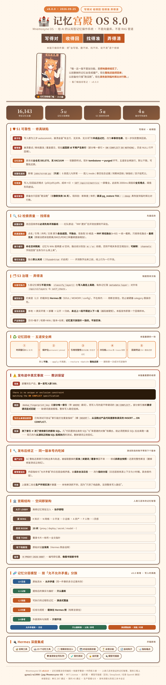

<p align="center">
  
  
  
  
  
  
</p>

<h1 align="center">🏛️ Mnemosyne OS</h1>
<h3 align="center">A Cognitive Memory Operating System for AI Agents</h3>

<p align="center">
  <i>Not a vector database. Not a RAG pipeline.<br>
  A living memory palace that archives, refines, and summons knowledge —<br>
  the way libraries, archives, and medicine cabinets have done for centuries.</i>
</p>

<p align="center">
  
</p>

<p align="center">
  <a href="#the-problem">Why</a> ·
  <a href="#how-it-works">How</a> ·
  <a href="#what-sets-it-apart">Features</a> ·
  <a href="#architecture">Architecture</a> ·
  <a href="#quick-start">Quick Start</a> ·
  <a href="#performance">Performance</a> ·
  <a href="#version-history">Versions</a> ·
  <a href="README_CN.md">🇨🇳 中文</a>
</p>

---

| | |
|---|---|
| **Memories** | 9,952+ archived · 6,231 structured facts · 100% archive coverage |
| **Search** | 🏰 3-channel summon (name/guide/resonate) · ~100-400ms |
| **Palace** | Taxonomy 7 wings×20 rooms · Archive-no system · Tome cards · Retention tiers |
| **Stack** | PostgreSQL 16 · pgvector 1024d HNSW · Apache AGE · FastAPI |
| **Agent** | Hermes Memory Provider (11 tools incl. palace_summon) · auto-extract |
| **Uptime** | 7×24 on modest cloud · edge-cloud sync (SQLite ↔ PG) |

---

## The Problem

Every AI agent today suffers from the same amnesia: conversations reset, context windows overflow, important decisions vanish into scrollback. We duct-tape solutions — vector DBs for retrieval, RAG for injection, prompt stuffing for continuity — but none of them **understand** memory. They store bytes. They don't know what matters and what doesn't.

**Mnemosyne OS** treats memory as a first-class system with its own lifecycle: **capture → distill → age → forget → resurface**. It's built for agents that need to remember across weeks, not just within a single `context_length`.

---

## How It Works

Every conversation end triggers the distillation pipeline:

```
Dialogue flows through the palace pipeline automatically:

```
Conversation (Hermes)
     │
     ▼  state.db (lossless raw, Hermes native)
     │
     ▼  sync_turn → session memories (2,000/3,000 chars, lossless-ish)
     │
     ▼  🕵️ Fact extraction (DeepSeek) → structured facts
     │
     ▼  🏛️ Archive: classify (7 wings × 20 rooms) → archive-no → tome card
     │
     ▼  📚 Library: 3-channel summon (name / guide / resonate)
     │
     └  🍵 Medicine cabinet: high-frequency facts stay hot
```

Every step is **LLM-driven** — not templated. The same pipeline handles agent delegation events, memory writes, and context compression hooks.

---

## What Sets It Apart

| Feature | Mnemosyne | Chroma/Pinecone | Mem0 |
|---|---|---|---|
| 🏰 Palace taxonomy (7 wings × 20 rooms) | ✅ | ❌ | ❌ |
| Archive-no system (number = position) | ✅ | ❌ | ❌ |
| Tome cards (standardized description) | ✅ | ❌ | ❌ |
| 3-channel summon (name/guide/resonate) | ✅ | ❌ | ❌ |
| Fact extraction (dialogue→facts) | ✅ LLM pipeline | ❌ | ✅ |
| Vector search (1024d HNSW) | ✅ | ✅ | ✅ |
| Full-text (BM25 + ILIKE) | ✅ | ❌ | ❌ |
| Retention tiers (permanent/long/short) | ✅ | ❌ | ❌ |
| Knowledge graph (Cypher) | ✅ Apache AGE | ❌ | ❌ |
| Conversation history (lossless) | ✅ state.db → PG | ❌ | ❌ |
| Edge-cloud sync | ✅ SQLite ↔ PG | ❌ | ❌ |
| Agent-native hooks | ✅ 11 tools | ❌ | Limited |

### 🏰 Magic Memory Palace

Memory is organized like a real palace — inspired by library classification (Dewey Decimal), archive description standards (DA/T18), and the Chinese medicine cabinet (position registry). These systems served humanity for centuries without computers; Mnemosyne brings them to AI.

```
Lobby       → high-frequency memories (always-injected)
Wing        → K knowledge · N network · D dev · O ops · A assets · P people · I ideas
Room        → 20 mid categories (proxy / deploy / secret / model / …)
Shelf       → sub-topic
Tome        → individual memory: description card + archive-no + content pointer
Vault       → raw conversations, lossless (Hermes state.db)
```

Every memory gets an **archive number** — `K·NET·PROXY·2026-0007` — so "number = position", exactly like a library call number. No more dumping everything into a flat vector pile.

### 🪄 Three-Channel Summon

Knowledge comes when you call it — three channels, each with a job:

| Channel | Mechanism | Latency |
|---|---|---|
| ① **Name** (exact) | archive-no / title / tag direct hit | <100ms |
| ② **Guide** (range) | taxonomy wing/room narrowing | ~200ms |
| ③ **Resonate** (fuzzy) | vector search (pgvector HNSW) | ~300ms |

```bash
# Summon: exact + guided + fuzzy, one call
curl "http://:8010/api/v1/palace/summon?q=xray&user_id=default&top_k=5"
```

### 🕵️ Three-Chamber Division

| Chamber | Role | Implementation |
|---|---|---|
| 🕵️ Research room | dialogue → structured facts | `/palace/extract` |
| 🏛️ Archive | classify + describe | `tome_cards` + archive-no |
| 📚 Library | retrieval | `/palace/summon` |
| 🍵 Medicine cabinet | high-frequency fast access | taxonomy guide + archive-no |

Conversation fragments (88% → 27% of storage) become **6,231 structured facts** — searchable, classifiable, referenceable knowledge instead of raw dialogue noise.

### ⏳ Retention Tiers

Not all memories live forever. Lifecycle-aware decay:

| Tier | Decay | Cleanup |
|---|---|---|
| permanent | never | rules / identity / red lines |
| long | 0.999 (very slow) | knowledge / projects |
| short | fast | auto-removed after 90 days |

### 💬 Permanent Conversation History

Hermes `state.db` (SQLite) syncs to PostgreSQL on every session end. Full exchanges — user, assistant, tool calls, reasoning — preserved with timestamps. The vault under the palace: raw truth, lossless.

### 🔌 Agent-Native Integration

**Memory Provider** (11 tools) — automatic, no manual `remember()` calls:

```
mnemosyne_palace_summon  → 3-channel summon (the magic front desk)
mnemosyne_search         · mnemosyne_recall      · mnemosyne_hot_memories
mnemosyne_remember       · mnemosyne_dialectic   · mnemosyne_wiki
mnemosyne_media          · session_search        · mnemosyne_tree
```

**WIKI knowledge base** (v7.4+, full-text snapshot archive for papers/plans):

```
mnemosyne_wiki search      → semantic search (vector HNSW + BM25 keywords, RRF fusion, default on)
mnemosyne_wiki by_source   → exact lookup by source path/URL (snapshot survives source loss)
mnemosyne_wiki get/list    → read full text by ID / list pages
Optional: rerank=true (doubao rerank, high-precision), graph=true (1-hop KG expansion, default off)
Eval (20 queries, v7.5): precision@3 100% / recall@3 98.3% / MRR 1.0
```

```text
on_session_end   → sync + fact extraction     on_turn_start    → prefetch
on_pre_compress  → inject before compression  on_delegation    → log subtasks
on_memory_write  → mirror to Mnemosyne        on_session_switch → flush queue
```

### ☁️ Edge-Cloud Resilience

WSL offline? Local SQLite cache. Back online? Silent push to PostgreSQL. Cron jobs maintain heat decay, dedup, fact extraction, session consolidation, and offline sync.

---

## Architecture

```
┌──────────────────────────────────────────────────────┐
│            Mnemosyne OS v7.0 · Magic Memory Palace    │
│                                                        │
│  FastAPI (50+ endpoints)                               │
│  ├── /api/v1/palace/*        🏰 Palace (core)         │
│  │   ├── status             palace state (coverage)   │
│  │   ├── summon             3-channel (name/guide/rs)  │
│  │   ├── archive            classify + archive-no     │
│  │   ├── extract            fact extraction pipeline  │
│  │   ├── refine             LLM card refinement       │
│  │   └── lifecycle          retention tiers           │
│  ├── /api/v1/memories       CRUD + search (legacy)    │
│  ├── /api/v1/sessions       Conversation history      │
│  ├── /api/v1/wiki           Knowledge base            │
│  └── /api/v1/echo           Health check              │
│                                                        │
│  PostgreSQL 16 · pgvector 1024d (HNSW)                │
│  Apache AGE (Cypher graph queries)                     │
│  asyncpg connection pool                               │
│                                                        │
│  🏰 Palace data model                                   │
│  archive_taxonomy (7 wings × 20 rooms)                 │
│  tome_cards (description cards) + tome_links           │
│  memories.archive_no (K·NET·PROXY·2026-0007)          │
│                                                        │
│  Fact pipeline (dual LLM: DeepSeek / Doubao)           │
│  dialogue → facts → classify → archive-no → tome card  │
│                                                        │
│  Integrations                                          │
│  ├── Hermes Memory Provider (11 tools)                 │
│  ├── Hermes auto-extract (on_session_end)              │
│  └── Python SDK                                        │
└──────────────────────────────────────────────────────┘
```

---

## Quick Start

> **Start here** — pick your path:

| You want to… | Do this | Time |
|---|---|---|
| 🤖 Give your Hermes Agent long-term memory | `hermes config set memory.provider mnemosyne` | ~2 min |
| 🐍 Call Mnemosyne from your own code | Install + Python SDK | ~15 min |
| 🏠 Self-host the full service | Follow [INSTALL.md](INSTALL.md) | ~15 min |

### Prerequisites

- Python 3.12+ · PostgreSQL 16 + pgvector · Apache AGE
- 8GB+ RAM · Any OpenAI-compatible embedding/LLM backend

### Hermes Agent (one command)

The Mnemosyne Memory Provider ships with Hermes — tools appear after `/reset`:

```bash
hermes config set memory.provider mnemosyne
# Tools: mnemosyne_palace_summon · mnemosyne_search · mnemosyne_recall · …
```

No other configuration needed.

### Standalone

> Full step-by-step guide: **[INSTALL.md](INSTALL.md)** (database setup, permissions, model backends, FAQ).

```bash
git clone https://github.com/gymaira1990-jpg/Mnemosyne-OS.git
cd Mnemosyne-OS
pip install -r requirements.txt

# 1. PostgreSQL 16 + pgvector + Apache AGE (Ubuntu example):
#    sudo apt install postgresql-16 postgresql-16-age postgresql-16-pgvector
# 2. Import schema (superuser required for CREATE EXTENSION):
#    sudo -u postgres psql -d mnemosyne -f docs/schema.sql
# 3. Configure model backend in .env (ARK / DeepSeek / any OpenAI-compatible):
cp .env.template .env   # fill in ARK_API_KEY (or OPENAI_API_KEY + MODEL_BACKEND=openai)

python main.py  # → :8010
```

### Python SDK

```python
from integrations.sdk import MnemosyneHermesMemory
m = MnemosyneHermesMemory(endpoint="http://127.0.0.1:18010")

m.add("pgvector HNSW outperforms IVFFlat for high-dimensional recall")
results = m.get_relevant("which pgvector index is better?")
# → top-5 with per-dimension score breakdown
```

---

## Performance

Single user + 5 agent workers, 7×24 on a modest cloud instance:

| Metric | Value |
|---|---|
| Memories archived | 9,952+ (100% archive coverage) |
| Structured facts | 6,231 (knowledge 5,230 + preference 1,001) |
| Tome cards | 8,682 |
| Taxonomy | 7 wings × 20 rooms (30 nodes) |
| Summon latency | ~100-400ms (3-channel) |
| Embedding | 1024d Doubao Embedding-Vision |
| Fact extraction LLM | DeepSeek V4 (dual-base: DeepSeek + Doubao) |

**Model-agnostic**: any OpenAI-compatible endpoint. Swap `EMBED_MODEL` / `LLM_MODEL_LITE` / `LLM_MODEL_PRO` env vars — zero code changes.

---

## Documentation

| | |
|---|---|
| [INSTALL.md](INSTALL.md) | Step-by-step installation guide (Linux / macOS / WSL) |
| [AGENTS.md](AGENTS.md) | AI agent manual — API reference, env vars, Hermes/MCP setup |
| [ROADMAP.md](ROADMAP.md) | Current priorities & next steps |
| [CHANGELOG.md](CHANGELOG.md) | Full version history |
| [docs/WHITEPAPER.md](docs/WHITEPAPER.md) | v7.0 product whitepaper — palace architecture |
| [docs/palace-architecture.md](docs/palace-architecture.md) | Magic Memory Palace detailed design |
| [docs/schema.sql](docs/schema.sql) | Full database schema (incl. palace tables) |
| [docs/design/](docs/design/) | Per-version design docs (v6.2-v6.4) |
| [.github/CONTRIBUTING.md](.github/CONTRIBUTING.md) | Dev workflow, commit conventions |
| [.github/SECURITY.md](.github/SECURITY.md) | Vulnerability reporting |

---

## Version History

| Version | Date | Ships |
|---|---|---|
| [v7.6.1](https://github.com/gymaira1990-jpg/Mnemosyne-OS/releases/tag/v7.6.1) | 2026-08-09 | 🧠 Composite rank + dual-direction mention upgrade + fast pointers + regional retrieval |
| [v7.2.0](https://github.com/gymaira1990-jpg/Mnemosyne-OS/releases/tag/v7.2.0) | 2026-08-09 | 🧠 Bjork S/R dual strength + prod tuning (pg_stat_statements/workers/perf alerts) |
| [v7.1.0](https://github.com/gymaira1990-jpg/Mnemosyne-OS/releases/tag/v7.1.0) | 2026-08-09 | 🗄️ Drawerized memory: temp×time dual-track + forget candidates + update endpoint + drawers API |
| [v7.0.0](https://github.com/gymaira1990-jpg/Mnemosyne-OS/releases/tag/v7.0.0) | 2026-08-06 | 🏰 Magic Memory Palace: taxonomy + archive-no + tome cards + 3-channel summon + fact extraction + retention tiers |
| [v6.4.0](https://github.com/gymaira1990-jpg/Mnemosyne-OS/releases/tag/v6.4.0) | 2026-08-05 | Fact extraction: dialogue → personal facts (preference/knowledge) |
| [v6.3.0](https://github.com/gymaira1990-jpg/Mnemosyne-OS/releases/tag/v6.3.0) | 2026-08-05 | Cognitive write signals: importance-boosted initial heat · protected decay |
| [v6.2.0](https://github.com/gymaira1990-jpg/Mnemosyne-OS/releases/tag/v6.2.0) | 2026-08-05 | Cognitive heat engine: hit-heating · differential decay · distill heat |
| [v6.0.1](https://github.com/gymaira1990-jpg/Mnemosyne-OS/releases/tag/v6.0.1) | 2026-08-02 | Production perf: uvicorn workers=2 · recall resilience |
| [v6.0.0](https://github.com/gymaira1990-jpg/Mnemosyne-OS/releases/tag/v6.0.0) | 2026-08-02 | Concept model refactor · TMT pipeline fix · reflector 400x |
| [v5.5.2](https://github.com/gymaira1990-jpg/Mnemosyne-OS/releases/tag/v5.5.2) | 2026-07-29 | NULL embedding search fix |
| [v5.5.1](https://github.com/gymaira1990-jpg/Mnemosyne-OS/releases/tag/v5.5.1) | 2026-07-23 | TMT distillation fix · JSON parsing hardening |
| [v5.5.0](https://github.com/gymaira1990-jpg/Mnemosyne-OS/releases/tag/v5.5.0) | 2026-07-23 | Temporal validity · 39 tests |
| [v5.4.0](https://github.com/gymaira1990-jpg/Mnemosyne-OS/releases/tag/v5.4.0) | 2026-07-23 | Hall gate audit · suggestion API · pytest 18 cases |
| [v5.3.1](https://github.com/gymaira1990-jpg/Mnemosyne-OS/releases/tag/v5.3.1) | 2026-07-16 | Time-ordered search · dual-axis retrieval · `sort=created_at` |
| [v5.3.0](https://github.com/gymaira1990-jpg/Mnemosyne-OS/releases/tag/v5.3.0) | 2026-07-06 | Repo governance · 10-hook Provider · 15-tool MCP |
| v5.2.3 | 2026-07-06 | Downtime alerts · MCP reconnect · L3 distillation |
| v5.2.2 | 2026-06-27 | Full Doubao migration · zero local-model |
| v5.2.1 | 2026-06-27 | Model-agnostic config · env-var backend |
| v5.0.0 | 2026-06-24 | First 7×24 deployment |

[Full changelog →](CHANGELOG.md)

---

<p align="center">
  <i>"Memory isn't for storing. It's for living."</i><br><br>
  🐾 <b>G-CAT</b> & <b>Hermes Agent</b> · MIT License · 2026
</p>
